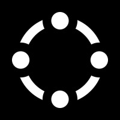

# Technical Test Kadre



## Description

This project is a **technical test** developed with **React & Vite** and **NodeJS**, using **NEXTUI** for the user interface and **Express** with **MongoDB** for the server. The goal of this application is to provide an intuitive and modern user experience for managing trucks.

### Features

- Visualization of trucks in a table.
- Functionality to create, update, get information and soft delete trucks.
- Responsive design using Tailwind.

> [!IMPORTANT] 
> Verify if your computer has the correct compatible dependencies to run the project locally.

## Technologies Used

- React (18.2.0): A framework for building web applications.
- Nextui (2.3.6): A rich UI component library for React that accelerates the development of attractive interfaces.
- TypeScript: A superset of JavaScript that adds static typing to the language.

> [!TIP]
> This project includes a back-end folder, which contains the server and database deployed at a test link; Backend link: https://challenge-kadre-production.up.railway.app/

> [!NOTE] 
> If you do not have the appropriate tools to deploy the project locally, you can visit this link: https://challenge-kadre.vercel.app/ 

## Installation

1. **Clone the repository**:

   ```bash
   git clone https://github.com/JoaquinFiorio/challenge-kadre.git


2. **Navigate to the project folder**:

   ```bash
   cd front-end

3. **Install the dependencies**:

   ```bash
   npm install

4. **Start the development server**:

   ```bash
   npm run dev

5. **Go to the development link**:

   ```bash
   http://localhost:5173/
